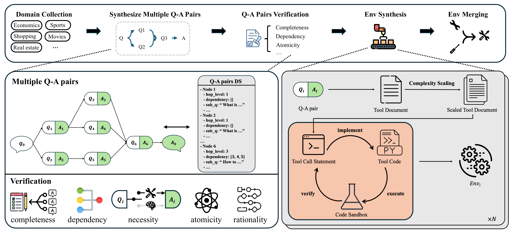

<h4 align="center">
    <p>
        <a href="README_zh.md">简体中文</a> |
        <b>English</b>
    </p>
</h4>

<div align="center">


# ASTRA：Automated Synthesis of agentic Trajectories and Reinforcement Arenas

[](https://lianjiatech.github.io/astra.blog/)
[](https://huggingface.co/collections/Emperorizzis/astra-dataset)
[](https://huggingface.co/collections/Emperorizzis/astra-models)
[]()
[](assets/LICENSE.txt)

</div>


## 📖 Overview
This repository provides an end-to-end pipeline for **fully automated**, **verifiable** synthesis of high-quality data and environments, with native support for **process-level rewards**. It is designed for training models with multi-step reasoning and tool-use capabilities and easy to **scale** to new tasks and tools. Here are the two main modules:

- **Trajectory Synthesis**: Automatically generate high-quality, multi-step interactive **trajectories** and verified by **reward system**.

- **Environment Synthesis**: Fully automatically synthesize interactive **environments** with **no human labels required** that provide **step-wise process rewards** to enable **RLVR**. 


| Module | Function | Directory |
|--------|----------|-----------|
| **Trajectory Synthesis** | Tool graph construction → Task generation → Trajectory collection → Reward assessment | [`trajectory_synthesis/`](trajectory_synthesis/) |
| **Environment Synthesis** | Question decomposition → Automatic tool environment generation → RLVR training data | [`env_synthesis/`](env_synthesis/) |

## 🏆 Model Performance

We release two models: **ASTRA-32B-Thinking-v1** and **ASTRA-14B-Thinking-v1**, which are trained with SFT and RL using our synthesized data. Below are the evaluation results on **BFCL-V3-MT**:

| Model | Base | Long Context | Miss Func | Miss Param | Average ↓ |
|-------|------|--------------|-----------|------------|---------|
| Claude-Opus-4-5-20251101 | 81.5 | 70.5 | 64.0 | 58.0 | 68.5 |
| GLM-4.6 | 74.5 | 66.5 | 68.0 | 63.0 | 68.0 |
| **ASTRA-32B-Thinking-v1** | **76.5** | **66.5** | **65.5** | **48.5** | **64.3** |
| Gemini-3-Pro-Preview | 69.0 | 64.0 | 63.0 | 56.5 | 63.1 |
| o3-2025-04-16 | 68.0 | 63.0 | 63.5 | 54.5 | 62.3 |
| Claude-Sonnet-4-5-20250929 | 69.0 | 59.0 | 65.0 | 52.5 | 61.4 |
| Grok-4-1-fast-reasoning | 70.5 | 62.5 | 59.5 | 43.0 | 58.9 |
| **ASTRA-14B-Thinking-v1** | **67.0** | **61.0** | **56.0** | **48.5** | **58.1** |
| LoopTool-32B (Report From Paper)  | - | - | - | - | 57.8 |
| Claude-Haiku-4-5-20251001 | 63.5 | 56.0 | 42.5 | 52.5 | 53.6 |
| Kimi-K2-Instruct| 62.0 | 55.0 | 41.0 | 44.5 | 50.6 |
| Qwen3-32B | 59.0 | 51.5 | 47.5 | 40.5 | 49.6 |
| Qwen3-30B-A3B-Thinking-2507 | 66.0 | 58.0 | 31.5 | 35.5 | 47.8 |
| TouCan-32B (Report From Paper) | - | - | - | - | 46.5 |
| Qwen3-14B | 50.5 | 48.0 | 39.5 | 40.0 | 44.5 |
| Qwen3-30B-A3B-Instruct-2507| 43.5 | 41.0 | 10.5 | 25.0 | 30.0 |

---

## 🔄 Pipelines

### Part 1: Trajectory Synthesis

<div align="center">

</div>

Starting from MCP Server tool documentation, build tool dependency graphs and generate high-quality SFT training data.

```
mcp_servers.jsonl → Graph construction → Task generation → LLM interaction → Reward assessment → SFT data
```

👉 **For detailed usage instructions, please refer to [`trajectory_synthesis/README.md`](trajectory_synthesis/README.md)**

---

### Part 2: Environment Synthesis

<div align="center">

</div>

Automatically generate executable tool environments from Q&A pairs, supporting RLVR training.

```
QA data → Question decomposition → Tool necessity check → Verification → Environment synthesis → Tool merging
```

👉 **For detailed usage instructions, please refer to [`env_synthesis/README.md`](env_synthesis/README.md)**

---

## 🆕 Updates

| Date | Updates |
|------|---------|
| 2026/01 | 🎉 Release Code, Models, and Datasets |
| Coming Soon | 📄 Paper |

---

## 📜 License

This project is licensed under [Apache 2.0 License](assets/LICENSE.txt).

---

## 📎 Citation

```bibtex
@misc{astra2026,
  title={ASTRA：Automated Synthesis of agentic Trajectories and Reinforcement Arenas},
  author={Beike Language and Intelligence (BLI)},
  year={2026},
}
```
